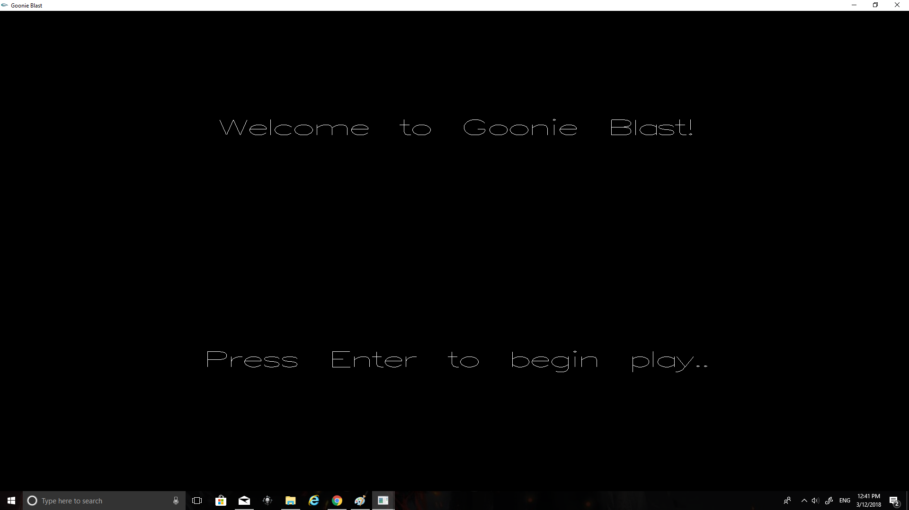
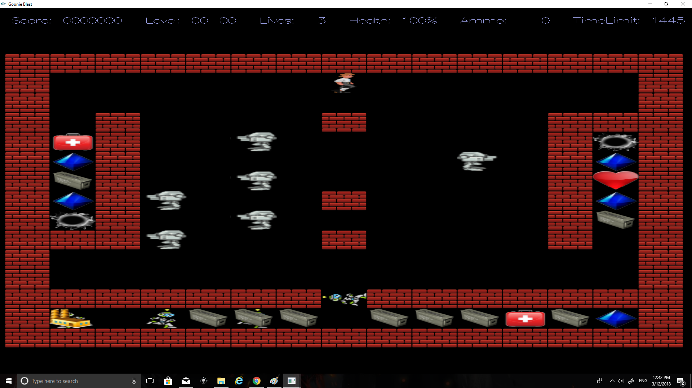

# GoonieBlast
GoonieBlast is a school final project which features a classic 2D game mode. 

All of the Actor class, enemy class, robot class and goodie class are implmented under low level C++ code without help of any game engine.

Please download the whole project and go to the release folder. The .exe file is there with libraries.

A hero can eat diamonds to increase its health, go to upstairs or downstairs by a cave and be attacked by some malicious robot. 

